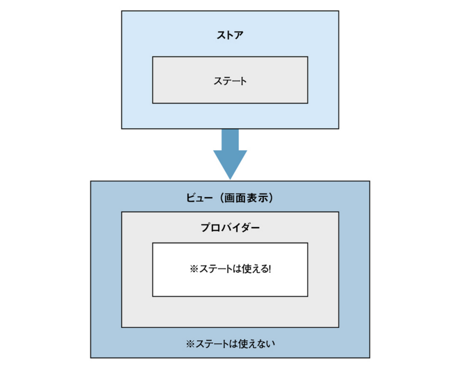

# Redux Sample

## What is Redux

Reduxは、状態管理ユーティリティ。

Reactでは、様々なコンポーネントの状態が個別に扱われるが、それらを統合して管理する機能を提供する。

### ３つの大きな特徴

- 値の保管場所は１つ

  全てのデータは「ストア」と呼ばれるところに保管される。

  これはアプリケーションごとに１つだけ用意されている。

- 値は読み取り専用、書き換え不可

  特設ストアを書き換えることはできない。

- 変更は単純な関数で用意

  値は変更できないわけではなく、新たに設定する値を作成し返す関数を用意することで、ストアの変更が可能になる。

### 仕組み

#### ストア

データを保管し管理するもの。ここに保管される値は「ステート」と呼ばれる。

- ストアの作成

```js
  変数 = createStore( レデューサー);
```

  ストアは、ReduxのcreateStore関数で作成する。

  引数にレデューサーを指定して呼び出す。

#### プロバイダー

ストアを他のコンポーネントに受け渡すための仕組み。

プロバイダーのタグのなかにコンポーネントを記述するとそれらの内部のコンポーネントでストアに保管されている値や処理が使えるようになる。



#### レデューサー

ストアに保管されるステートを変更するための仕組み。

- レデューサーの作成

```js
  function 関数名(state = ステート, アクション) {
    ...処理
  }
```

  stateには、ストアに保管する値（ステート）を指定する。

  「アクション」は、レデューサーを実行する際に渡される値。

## How to install

Redux本体のインストール

```shell
yarn add redux
```

ReactとReduxをシームレスに融合して使うためのパッケージをインストール

```shell
yarn add react-redux
```

ReactのDevToolsに、Redux関係の機能を追加するパッケージをインストール

```shell
yarn add redux-devtools --dev
```

## 参照

[React.js&Next.js超入門 Section4-1](https://www.amazon.co.jp/React-js-Next-js%E8%B6%85%E5%85%A5%E9%96%80-%E6%8E%8C%E7%94%B0-%E6%B4%A5%E8%80%B6%E4%B9%83/dp/4798056928)

This project was bootstrapped with [Create React App](https://github.com/facebook/create-react-app).

## Available Scripts

In the project directory, you can run:

### `yarn start`

Runs the app in the development mode.<br />
Open [http://localhost:3000](http://localhost:3000) to view it in the browser.

The page will reload if you make edits.<br />
You will also see any lint errors in the console.

### `yarn test`

Launches the test runner in the interactive watch mode.<br />
See the section about [running tests](https://facebook.github.io/create-react-app/docs/running-tests) for more information.

### `yarn build`

Builds the app for production to the `build` folder.<br />
It correctly bundles React in production mode and optimizes the build for the best performance.

The build is minified and the filenames include the hashes.<br />
Your app is ready to be deployed!

See the section about [deployment](https://facebook.github.io/create-react-app/docs/deployment) for more information.

### `yarn eject`

**Note: this is a one-way operation. Once you `eject`, you can’t go back!**

If you aren’t satisfied with the build tool and configuration choices, you can `eject` at any time. This command will remove the single build dependency from your project.

Instead, it will copy all the configuration files and the transitive dependencies (webpack, Babel, ESLint, etc) right into your project so you have full control over them. All of the commands except `eject` will still work, but they will point to the copied scripts so you can tweak them. At this point you’re on your own.

You don’t have to ever use `eject`. The curated feature set is suitable for small and middle deployments, and you shouldn’t feel obligated to use this feature. However we understand that this tool wouldn’t be useful if you couldn’t customize it when you are ready for it.

## Learn More

You can learn more in the [Create React App documentation](https://facebook.github.io/create-react-app/docs/getting-started).

To learn React, check out the [React documentation](https://reactjs.org/).

### Code Splitting

This section has moved here: https://facebook.github.io/create-react-app/docs/code-splitting

### Analyzing the Bundle Size

This section has moved here: https://facebook.github.io/create-react-app/docs/analyzing-the-bundle-size

### Making a Progressive Web App

This section has moved here: https://facebook.github.io/create-react-app/docs/making-a-progressive-web-app

### Advanced Configuration

This section has moved here: https://facebook.github.io/create-react-app/docs/advanced-configuration

### Deployment

This section has moved here: https://facebook.github.io/create-react-app/docs/deployment

### `yarn build` fails to minify

This section has moved here: https://facebook.github.io/create-react-app/docs/troubleshooting#npm-run-build-fails-to-minify
